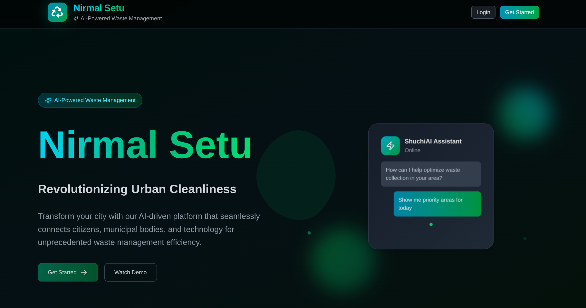
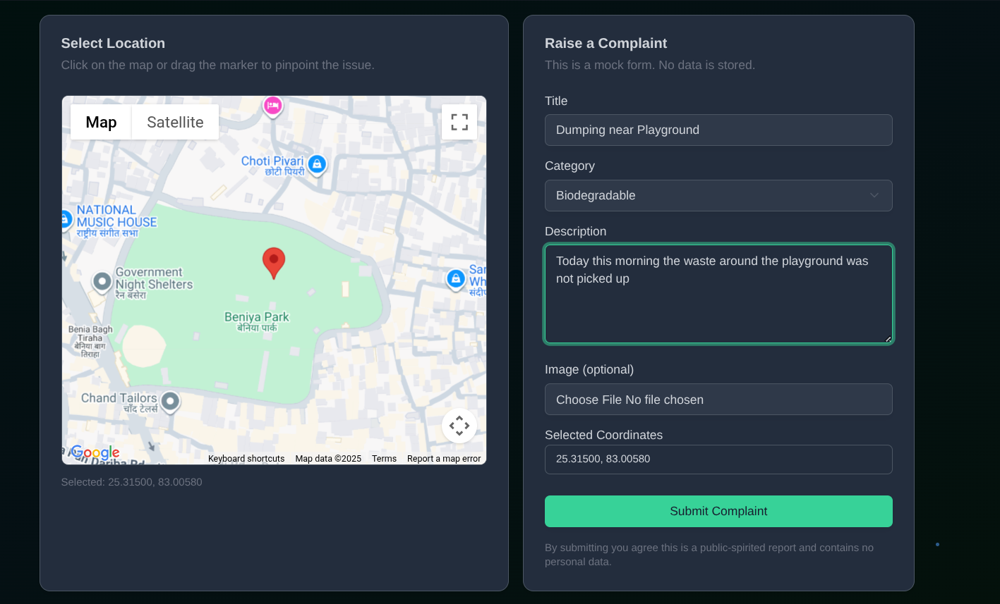
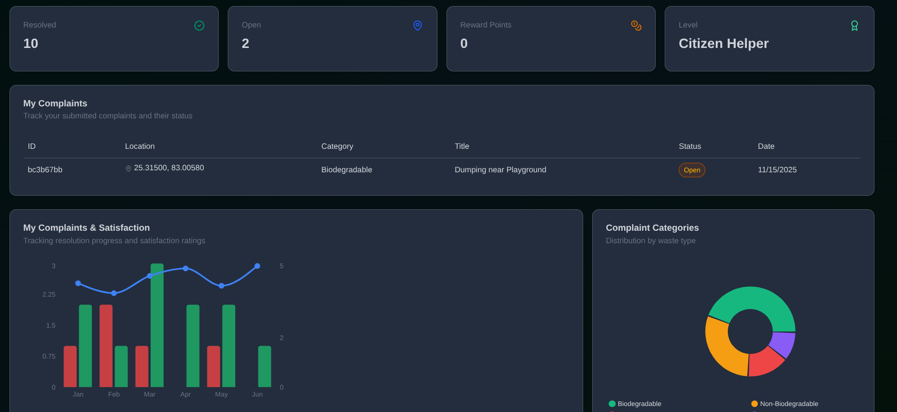
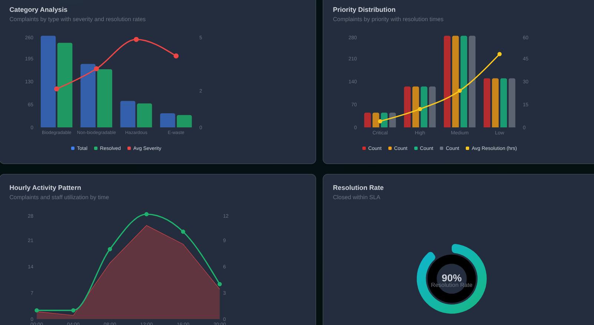

# Nirmal Setu ♻️

**Problem statement**:- Sustainability: Low-cost Energy Ideas, Student led Eco-solutions

Nirmal Setu is a full‑stack platform that helps citizens, field staff, and administrators work together for cleaner cities — powered by **AI assistance**, **geo‑tagged complaints**, **gamified waste‑segregation training**, and an **analytics‑driven admin dashboard**.

**[Tech Stack](./TechinalDetails.md)**

---

## 🌟 Highlights at a Glance

- 🤖 **ShuchiAI – In‑App AI Assistant**
- 🗺️ **Google Maps–Enabled Complaint Submission**
- 🎮 **Waste Segregation Game (Gamified Learning)**
- 📊 **Rich Admin Analytics Dashboard**
- 📱 **Citizen Dashboard with Rewards & Insights**
- 🔐 **Auth + Role‑Based Access (User/Admin)**

---

## 💡 What is Nirmal Setu?

Nirmal Setu is designed as a **software‑only, city‑scale waste accountability platform**.  
It focuses on:

- ✅ **Citizens** – report issues quickly, learn waste segregation, and stay engaged.
- ✅ **Administrators** – monitor city cleanliness, track performance, and close complaints faster.
- ✅ **Transparency** – every complaint is geo‑tagged, time‑stamped, and visible in the admin console.

---

## 🚀 Core Features

### 🤖 ShuchiAI – AI Chatbot for Cleanliness & Governance

- **Contextual in‑app assistant**:  
  Helps with raising/understanding complaints, dashboard metrics, and rewards.
- **Multi‑language friendly**:  
  Prompted to **match the user’s language** where possible (e.g., English + Indian languages).
- **Task‑oriented guidance**:  
  Explains how to report issues, interpret analytics, and plan cleanliness actions.
- **Streamed responses** for a responsive chat experience.

### 🗺️ Google Maps–Enabled Complaint Submission

The Complaint page provides a smooth, map‑first flow for citizens:

- 🧭 **Live geolocation + draggable marker** using Google Maps JS API.
- 📍 **Geo‑tagged complaints** – latitude/longitude are captured and stored in the database.
- 📝 **Structured complaint form**:
  - Title, category (biodegradable / non‑biodegradable / other)
  - Description field
  - Optional image file input (for attaching proof/screenshots in the UI)
- 🔗 **Instant feedback**:
  - Confetti + thank‑you card
  - **Reference ID** (complaint ID from DB)
  - Direct **“View on Google Maps”** link for the reported location
- 🔒 **Protected endpoint**: only authenticated users can submit complaints.

### 🎮 Waste Segregation Game (Gamified Learning)

The platform includes an **interactive drag‑and‑drop game** to teach waste segregation:

- Accessible from **User Dashboard → “Play Waste Segregation Game”**.
- Users drag waste items (e.g., 🍌 Banana Peel, 🧴 Plastic Bottle, 🔋 Used Battery) into:
  - 🌿 **Biodegradable**
  - 🧴 **Non‑Biodegradable**
- **Instant feedback**:
  - ✅ Correct → score boost + “Correct! 🎉”
  - ❌ Incorrect → gentle penalty + “Try again! 🤔”
- **Progress tracking**: score, number of items answered, and final score summary.
- Smooth animations and UX via **Framer Motion**.

### 📊 Admin Dashboard – AI‑Inspired Monitoring Console

Admins get a dedicated **Admin Dashboard** at `/admin_dashboard`:

- 🔐 **Role‑based access** – only authenticated admins can reach this page.
- 🧾 **Complaints Table (live data)**:
  - Lists complaints from the DB (`complaints.list_complaints`)
  - Shows ID, user name, lat/lng, category, title, status, created date
  - Status chips: `open`, `in_progress`, `resolved`, `closed`
  - Actions:
    - Change status via TRPC mutation (`update_status`)
    - Delete complaint via TRPC mutation (`delete_complaint`)
- 📈 **Analytics Cards & Charts (sample data)**:
  - Monthly trend of raised/resolved/pending complaints + average resolution time
  - Category analysis (biodegradable, non‑biodegradable, hazardous, e‑waste)
  - Priority distribution (critical/high/medium/low)
  - Hourly activity patterns
  - Locality leaderboard with cleanliness & satisfaction scores

All charts are implemented using **Recharts** with a polished UI and animated layouts for a modern data experience.

---

### 🧑‍💻 Citizen Dashboard – Insights, Rewards & Assisted Actions

The **User Dashboard** (`/user_dashboard`) provides a citizen‑centric view:

- 🎯 **Quick actions**:
  - “Raise a Complaint” → navigates to `/complaint`
  - “Play Waste Segregation Game” → launches the game
  - “ShuchiAI” button → opens the AI chat dialog
- 📌 **Personal stats (demo data)**:
  - Resolved vs open complaints
  - Reward points and level (e.g., “Citizen Helper”)
- 📊 **Visual insights** (currently using mock data for UI demonstration):
  - My complaints vs satisfaction over months
  - Category distribution
  - Locality cleanliness scores vs targets
  - Weekly engagement & points

This page acts as the main **engagement hub** for citizens, combining **learning, reporting, and feedback**.

---

## 🗺️ User Flows (How it Works)

### 👤 Citizen Flow

1. **Sign up / Log in** via the landing page.
2. Navigate to **Dashboard** (`/user_dashboard`).
3. To report an issue:
   - Click **“Raise a Complaint”**.
   - Confirm location on the **Google Map** (use current location or drag the marker).
   - Fill title, category, description, and optionally attach an image.
   - Submit – get a **reference ID** and Google Maps link.
4. Use **ShuchiAI** anytime to:
   - Ask how to track issues or interpret metrics.
   - Learn best practices for waste segregation and reporting.
5. Play the **Waste Segregation Game** to learn and stay engaged.

### 🛠️ Admin Flow

1. Admin logs in and is redirected to **Admin Dashboard** (`/admin_dashboard`).
2. See **recent complaints table** with user details, location, and status.
3. Use actions menu to:
   - Mark a complaint as `open`, `in_progress`, `resolved`, or `closed`.
   - Delete spam/invalid complaints.
4. Use charts and leaderboards (sample data) to:
   - Understand complaint trends.
   - Identify high‑priority categories or wards.
   - Monitor resolution performance visually.

---

## 🧭 Related Docs

- 📄 **[Techinal Details](./TechinalDetails.md)** – architecture, tech stack, and developer setup.

---

## 🧱 Roadmap (High‑Level Ideas)

Some features from the original concept that can be layered on top of the **already implemented core**:

- 🔮 **Deeper ML‑driven analytics** (true predictive models on top of complaint history).
- 🏆 **Full reward ledger & redemption workflows** (beyond current points display).
- 📱 **Dedicated mobile app** reusing the same API and auth stack.

The current codebase already implements the **AI chatbot**, **geo‑tagged complaints**, **gamified training**, and **admin dashboard**, providing a solid foundation for further innovation.

## Screenshots

<table>
<tr>
<td width="50%">
  
</td>
<td width="50%">
  
</td>
</tr>
<tr>
<td width="50%">
  
</td>
<td width="50%">
  
</td>
</tr>
</table>

**Demo Link** : [Youtube Video](https://youtu.be/XMshOGCCvFQ?si=7xoEOjqO-qFit1Ar)
